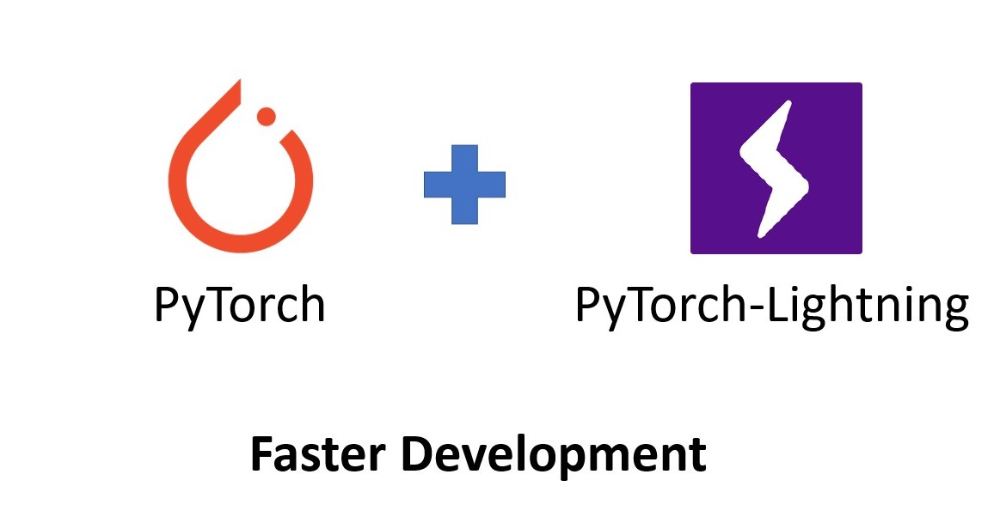
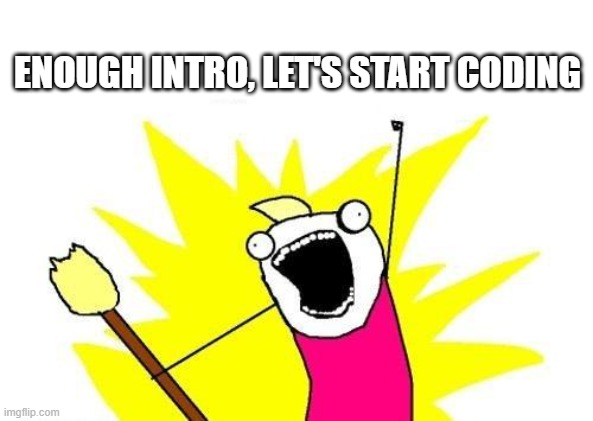

# Lightning Start to Distributed Deep Learning Using Pytorch and Pytorch-Lightning

Pytorch is one of the popular and the fastest growing deep learning framework. The flexibility of this framework allows academicians and researchers to quickly prototype research ideas. Moreover, the simplicity of the PyTorch framework smoothes the learning curve for beginners. 


<div style="text-align:center">

</div>


Although the PyTorch framework allows you to quickly implement your awesome ideas, you still need to write lots of boilerplate codes, such as data pre-processing for training and validation loop, model saving, metrics calculation, logging, 16-bit precision training, etc... Moreover, suppose you want to train your model in a distributed computing environment (multi-GPUs or TPU or cluster environment). In that case, you have to write a lot of boilerplate code, which is troublesome and may introduce bugs. Writing and debugging these boilerplate codes may thwart your enthusiasm to implement your fantastic idea. If you face procrastination issues like me, maybe the boring boilerplate codes may throw you in the procrastination black-hole and prevent you from starting working on your Super-Duper game-changing learning model.

<div style="text-align:center">

</div>

Here comes the PyTorch-Lightning, an awesome wrapper of the PyTorch framework to help you quickly implement your awesome idea without wasting your energy in writing boring boilerplate codes. PyTorch-Lightning already implemented all the boring pieces of stuff that allow you to start working on your super cool idea right away.

<div style="text-align:center">

</div>

**Pre-requisite: You need to have basic knowledge of deep learning.**

In this step-by-step tutorial, we will learn how to develop and train a learning model using PyTorch with the PyTorch-Lightning framework in a lightning speed. Specially, we will learn how fast we can switch to GPU or TPU distributed training, without writing and tedious boilerplate code and simply just changing **ONE LINE OF CODE**.

In this tutorial, we will develop a simple hand-written digit classifier using MNIST hand-written dataset. To train this learning model, you only need to write DataLoader and learning model; PyTorch-Lightning will handle the rest of the things.

<div style="text-align:center">
<figure>

    
    
<figcaption>MNIST Dataset Examples (Source: <a href="https://en.wikipedia.org/wiki/MNIST_database">Wikipedia</a>)</figcaption>
</figure>
</div>

You can open [this tutorial in Google Colab](https://colab.research.google.com/drive/1S3exBTkT6P5a_5HI3O_fEOWQ_TH5r-26?usp=sharing) and start executing right away.

## Setup Environment

First, we need to prepare our environment by installing the PyTorch and PyTorch-Lightning library:


*   Install the PyTorch library by following the step given [here](https://pytorch.org/get-started/locally/)
*   Install PyTorch-XLA by executing the following two commands (we only need this for TPU training; otherwise, you can skip this step)


```
!curl https://raw.githubusercontent.com/pytorch/xla/master/contrib/scripts/env-setup.py -o pytorch-xla-env-setup.py
!python pytorch-xla-env-setup.py --version nightly --apt-packages libomp5 libopenblas-dev
!pip install cloud-tpu-client==0.10 https://storage.googleapis.com/tpu-pytorch/wheels/torch_xla-1.6-cp36-cp36m-linux_x86_64.whl
```


*   Install PyTorch-Lightning by executing the following commands


```
!pip install pytorch-lightning
```

That's all you need to start implementing your super cool idea.

## Prepare DataModule

First, we need to prepare the training, validation, and testing dataset. In the PyTorch-Lightning DataModule, implement the following methods, and the PyTorch-Lightning will handle the rest of the data processing.


*   `prepare_data()`: This method will be executed once to download the dataset or other pre-processing kinds of stuff.


```python
class CoolDataModule(LightningDataModule):
    
  def prepare_data(self):
      datasets.MNIST(root=".", train=True, download=True)
      datasets.MNIST(root=".", train=False, download=True)
```


*   `setup()`: This method will be called in each GPU. Here we can create the train, val, and test datasets.


```python
class CoolDataModule(LightningDataModule):

  def setup(self, stage):
      transform=transforms.Compose([transforms.ToTensor()])

      full_train_dataset = datasets.CIFAR10(root=".", train=True, download=True, transform=transform)
      self.train_dataset, self.val_dataset = random_split(full_train_dataset, [50000, 10000])
      self.test_dataset = datasets.CIFAR10(root=".", train=False, download=True, transform=transform)
```

* `train_dataloader(), val_dataloader, test_dataloader()`: In these methods, we will create the train, val, and test dataloaders using the datasets, which we created in the `setup()` method.

```python
class CoolDataModule(LightningDataModule):

  def train_dataloader(self):
        return DataLoader(self.train_dataset, 
                          batch_size=self.batch_size, 
                          shuffle=True, 
                          num_workers=self.num_workers)

    def val_dataloader(self):
        return DataLoader(self.val_dataset, 
                          batch_size=self.batch_size, 
                          shuffle=True, 
                          num_workers=self.num_workers)

    def test_dataloader(self):
        return DataLoader(self.test_dataset, 
                          batch_size=self.batch_size, 
                          shuffle=True, 
                          num_workers=self.num_workers)
```

**Now putting all these methods in the DataModule:**


```
from torchvision import datasets
from torchvision import transforms
from torch.utils.data import random_split
from torch.utils.data import DataLoader
from pytorch_lightning import LightningDataModule
from pytorch_lightning import Trainer
import math 

class MNISTDataModule(LightningDataModule):

  def __init__(self, batch_size, num_workers):
    super(MNISTDataModule, self).__init__()

    self.batch_size = batch_size
    self.num_workers = num_workers

  def prepare_data(self):
    datasets.MNIST(root=".", train=True, download=True)
    datasets.MNIST(root=".", train=False, download=True)

  def setup(self, stage):
    transform=transforms.Compose([transforms.ToTensor()])

    full_train_dataset = datasets.MNIST(root=".", train=True, download=True, transform=transform)
    full_train_dataset_len = len(full_train_dataset)
    val_dataset_len = math.floor(full_train_dataset_len * 0.2)
    train_dataset_len = full_train_dataset_len - val_dataset_len

    self.train_dataset, self.val_dataset = random_split(full_train_dataset, [train_dataset_len, val_dataset_len])
    self.test_dataset = datasets.MNIST(root=".", train=False, download=True, transform=transform)

  def train_dataloader(self):
      return DataLoader(self.train_dataset, 
                        batch_size=self.batch_size, 
                        shuffle=True, 
                        num_workers=self.num_workers)

  def val_dataloader(self):
      return DataLoader(self.val_dataset, 
                        batch_size=self.batch_size, 
                        shuffle=True, 
                        num_workers=self.num_workers)

  def test_dataloader(self):
      return DataLoader(self.test_dataset, 
                        batch_size=self.batch_size, 
                        shuffle=True, 
                        num_workers=self.num_workers)
```

# Develop Learning Model

Now, let's create a simple model to classify the MNIST hand-written digits. Here we only use two linear layers to classify the hand-written digit image. Later, you can try to modify it by adding convolutional layers. In PyTorch-Lightning, you can develop your model in three steps:


1.   **First**, design the learning model part and pass the data through the model to produce the logits:

```python
class SimpleModel(LightningModule):
  def __init__(self):
    super(CoolModel, self).__init__()

    self.layer1 = nn.Linear(3* 32 * 32, 128)
    self.layer2 = nn.Linear(128, 10)

  def forward(self, x):
    x = x.view(x.size(0), -1)
    embed = self.layer1(x)
    embed = F.relu(embed)
    logits = self.layer2(embed)

    return logits
```

2. **Second**, specify how each batch will be process in each train/val/test loop iteration by implementing the following three methods:

```python
class SimpleModel(LightningModule):

  def training_step(self, batch, batch_idx):
    x, y = batch
    y_hat = self(x)
    loss = F.cross_entropy(y_hat, y)
    return loss

  def validation_step(self, batch, batch_idx):
    x, y = batch
    y_hat = self(x)
    loss = F.cross_entropy(y_hat, y)
    return loss
  
  def test_step(self, batch, batch_idx):
    x, y = batch
    y_hat = self(x)
    loss = F.cross_entropy(y_hat, y)
    return loss
```
Here in the train/val/test step, we pass the data `x` through our model and calculate the loss. Here you can calculate the other metrics and return as a dict in the following way:

```
return {'loss': loss, 'accuracy': accuracy}
```
PyTorch-Lightning provides some wrapper API to calculate several learning metrics; for more detail, you can check [PyTorch-Lightning Metrics-API Docs](https://pytorch-lightning.readthedocs.io/en/stable/metrics.html)

3. **Third**, initialize the optimizer in the `configure_optimizers()` method, which will be used to train your model. If you want to use a learning-rate scheduler, you can also initialize and return the scheduler from this method. 

```python
class SimpleModel(LightningModule):

  def configure_optimizers(self):
    optimizer = torch.optim.Adam(self.parameters(), lr=1e-3)
    return optimizer
```

Putting all things together, we can write the learning model as follows,


```
import torch
import torch.nn as nn
import torch.nn.functional as F
from torchvision import models
from pytorch_lightning import LightningModule


class SimpleModel(LightningModule):
  def __init__(self):
    super(SimpleModel, self).__init__()

    self.layer1 = nn.Linear(28*28, 128)
    self.layer2 = nn.Linear(128, 10)

  def forward(self, x):
    x = x.view(x.size(0), -1)
    embed = self.layer1(x)
    embed = F.relu(embed)
    logits = self.layer2(embed)

    return logits

  def training_step(self, batch, batch_idx):
    x, y = batch
    y_hat = self(x)
    loss = F.cross_entropy(y_hat, y)
    return loss

  def validation_step(self, batch, batch_idx):
    x, y = batch
    y_hat = self(x)
    loss = F.cross_entropy(y_hat, y)
    return loss
  
  def test_step(self, batch, batch_idx):
    x, y = batch
    y_hat = self(x)
    loss = F.cross_entropy(y_hat, y)
    return loss

  def configure_optimizers(self):
    optimizer = torch.optim.Adam(self.parameters(), lr=1e-3)
    return optimizer
```

# Train Model
After defining the DataModule and the learning model, which we already completed in the previous two steps, the training part is straightforward. We need to initialize the DataModule, Learning Module, and Trainer in the following way.


```
dataModule = MNISTDataModule(batch_size = 4, num_workers = 2)

model = SimpleModel()
trainer = Trainer(max_epochs=10)
```

Finally, we can simply call the fit method of the trainer to start the training:


```
trainer.fit(model, dataModule)
```

# Testing Model Performance

During training, PyTorch-Lightning saved the best model. Thus, to test your model performance on the testing dataset, we can simply call the trainer test method in the following way:


```
trainer.test()
```

# Distributed Training (Multi-GPUs or TPU)
**Now, the most exciting part: Distributed Training**. To speed-up the training and process, we just need to change only **one line of code**.

## Multi-GPUs Training
Let's consider that we want to train our model on two GPUs. We simply need to change the Trainer initialization line; the rest will be the SAME. **You do not need to change DataLoader or model or any other parts of your code for Multi-GPUs training.**


```
model = SimpleModel()
trainer = Trainer(max_epochs=10, gpus=2) # Here is the change
trainer.fit(model, dataModule)
```

## TPU Training
Similarly, if you want to train your model in the TPU environment, you just need to change the following **single line of code**:


```
model = SimpleModel()
trainer = Trainer(max_epochs=10, tpu_cores=8)
trainer.fit(model, dataModule)
```

**See!!! How easy it is?**

**Simply change one line of code and voila!! you can train your learning model in the distributed computing environment without changing any parts of the dataloader or model or writing any tedious boilerplate code.**

Now, you can implement your excellent idea by simply changing the DataModule and the learning model part. You do not need to write any extra tedious boilerplate code stuff. Let's start working on your awesome projects....... 


<div style="text-align:center">

</div>

To learn more about PyTorch and Pytorch-Lightning you can follow the following resources:


*   [Deep Learning with PyTorch: A 60 Minute Blitz](https://pytorch.org/tutorials/beginner/deep_learning_60min_blitz.html)
* [Intro to Deep Learning with PyTorch](https://www.udacity.com/course/deep-learning-pytorch--ud188)
* [PyTorch-Lightning MasterClass](https://www.youtube.com/playlist?list=PLaMu-SDt_RB5NUm67hU2pdE75j6KaIOv2)
*   [PyTorch-Lightning Documentation](https://pytorch-lightning.readthedocs.io/en/latest/)


